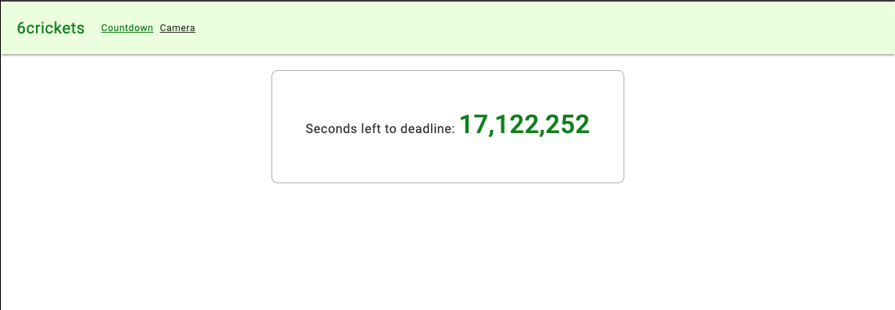
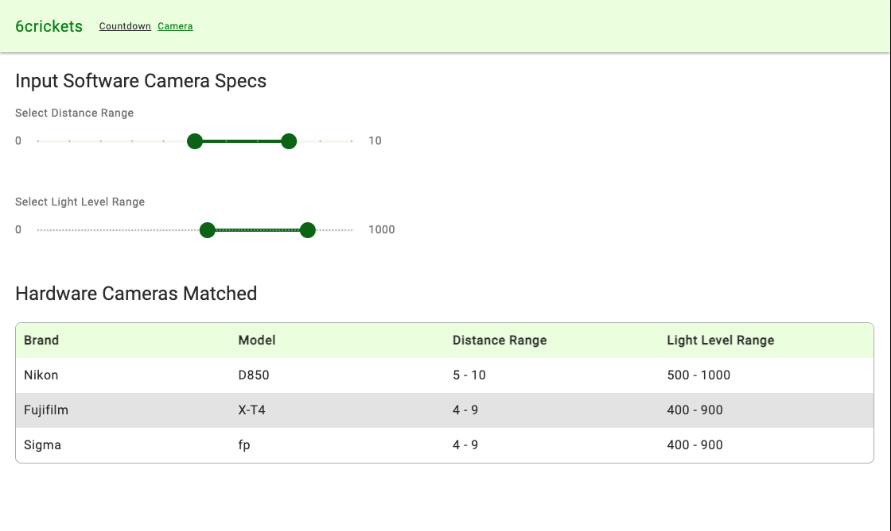

# 6Crickets

## Code References

API returning time in seconds: 
`apps/api/src/app/app.service.ts`  
[See GitHub Source](https://github.com/jerryorta-dev/6crickets/blob/main/apps/api/src/app/app.service.ts)

Angular service consuming API:
`libs/shared/domain/src/lib/services/api.service.ts`  
[See GitHub Source](https://github.com/jerryorta-dev/6crickets/blob/main/libs/shared/domain/src/lib/services/api.service.ts)

Countdown clock component:
`libs/shared/design-library-components/src/lib/components/deadline-clock`  
[See GitHub Source](https://github.com/jerryorta-dev/6crickets/blob/main/libs/shared/design-library-components/src/lib/components/deadline-clock)

Camera function:
`libs/shared/domain/src/lib/camera-sufficiency/is-hardware-camera-sufficient-check.ts`  
[See GitHub Source](https://github.com/jerryorta-dev/6crickets/blob/main/libs/shared/domain/src/lib/camera-sufficiency/is-hardware-camera-sufficient-check.ts)

## Environment setup 

Preferred Node to honor package-lock.json:
```bash
npm ci

```

or 

```bash
 npm install
```

## Start API server

Run: 

```bash
 npm run api
```

API serves at `http://localhost:3000/api` if you want to see the response of the API, you can visit `http://localhost:3000/api` in your browser.

## Start the application

In another terminal, run:

```bash
 npm run app
```
App serves at `http://localhost:4200`.

You will see two pages in the app:

1. The countdown clock page
    

2. The camera sufficiency check page
   


## Run tests

Run:
  
  ```bash
  npm run test
  ```

### Camera Sufficiency

To run jest test on only camara sufficiency check, run:

```bash
 npx nx run sixcrickets-app:test --testFile=hardware-camera-sufficient-check.spec.ts

```bash
 npx nx run sixcrickets-app:test --testFile=is-hardware-camera-sufficient-check.spec.ts
```

## Issues

If you encounter any issues after running tests, please run:

```bash
 npx nx reset
```

This will clean any Nx cache and stop all Deamon processes that may be running.

# Extras

## Shared Libraries

This project has a `libs/shared/domain` where common business logic and domain models are stored. This library is shared between the `api` and `app` applications.

Also this project has a `libs/shared/design-library-components` where common UI components are stored. These are presentation ( or "dumb") components that can be shared all applications _except_ the api.

## Theming
A common theming arhitecture is implemented in `llibs/shared/design-library-components/src/lib/themes`. While this project uses Angular Material, this architecture support native ( not material ) components as well. The architecture utilizes CSS vars to define theme specs. The goal is that for special use cases outside of a design system, the specs can easily be overridden at the application level, or in a system of components ( layout ) that comprises design system components.

## Domain Driven Design ( DDD )
This monorepo supports multiple applications and libraries. 

In the `apps` folder, you will find the `api` and `app` applications.
In the `libs` folder, you will find the `shared` library which contains the shared domain and design library components.

Thd "domain" library hints at domain driven design which is not fully implemented in this project. If I were to implement DDD, I would have a separate domain library for each domain in the application. The directory structure would be as follows:

```
  apps/
    [ domain name ] /
       app1/
       app2/
       api/
       
  libs/
    [ domain name ] / <-- share by all domain apps
       domain/
       ui/ <- ui components specific to the domain     
  shared/ <-- can be used by all apps and domains
       domain/
       ui/
       
```

To support DDD, there is a linting rull ( not implemented ) that prevents circular imports from libraries and applications.
